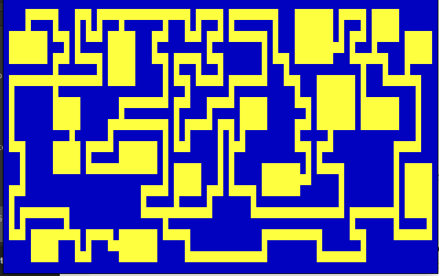

# Dungeon generator

Implementation of [Bob Nystrom's dungeon generator](https://journal.stuffwithstuff.com/2014/12/21/rooms-and-mazes/) with [Hunt-and-Kill maze generation](https://weblog.jamisbuck.org/2011/1/24/maze-generation-hunt-and-kill-algorithm), with visualization.
Requires [BearLibTerminal](http://foo.wyrd.name/en:bearlibterminal).

## Example

## Notes

Unfinished with messy code.